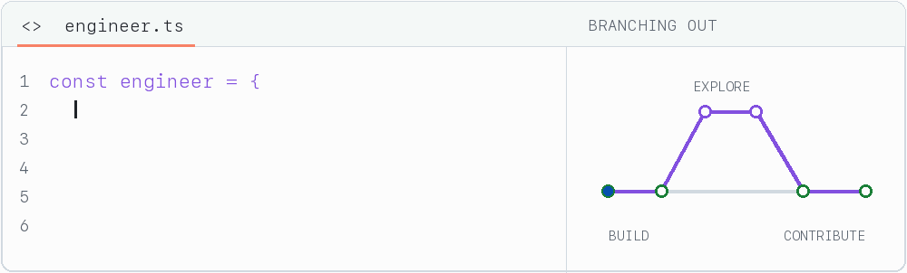

# Hi, I'm Muhammad Sibtain Asad

**Software Engineer · Web applications, APIs & AI exploration · Lahore, Pakistan**

[Portfolio](https://www.sibtainasad.com/) · [LinkedIn](https://www.linkedin.com/in/sibtain-asad/) · [Repositories](https://github.com/SIBTAIN-ASAD?tab=repositories) · [Open-source contributions](https://github.com/search?q=is%3Apr+is%3Amerged+author%3ASIBTAIN-ASAD+-user%3ASIBTAIN-ASAD&type=pullrequests)

<picture>
  <source media="(prefers-color-scheme: dark) and (prefers-reduced-motion: reduce)" srcset="./assets/activity-dark.png" />
  <source media="(prefers-reduced-motion: reduce)" srcset="./assets/activity-light.png" />
  <source media="(prefers-color-scheme: dark)" srcset="./assets/activity-dark.gif" />
  
</picture>

I build across the stack with **TypeScript, React, Python, and Django**. I enjoy connecting an interface to the services behind it, working through edge cases, and making software easier to use and maintain.

My work here spans web applications, API design, cloud infrastructure, and AI experiments, alongside fixes and tests contributed to open-source projects.

## Featured projects

### [Spotter](https://github.com/SIBTAIN-ASAD/Spotter) · Route & fuel planning

A Django REST API and interactive map that plans US driving routes and recommends fuel stops using a local price dataset.

- **Route planning:** GeoJSON geometry for map rendering, with routing and geocoding clients.
- **Fuel optimization:** Recommendations based on station prices and vehicle range.
- **Engineering:** Injectable services, automated tests, and a Docker development setup.

`Python` `Django REST Framework` `GeoJSON` `Docker` `pytest`

Inside the implementation

The API delegates to a route-planning service, which coordinates geocoding, routing, station lookup, and fuel optimization. External clients can be replaced in tests, while fuel-price lookups use the local dataset.

The project also includes request IDs, health checks, throttling, and consistent error responses. The public routing and geocoding services make it suitable for experimentation; deployments at scale would need their own service arrangements.

[Read the project documentation →](https://github.com/SIBTAIN-ASAD/Spotter#readme)

### [SAM Portfolio](https://github.com/SIBTAIN-ASAD/SAM-portfolio) · Interactive web experience

A personal showcase of my projects and experience, built with React and TypeScript, with Three.js visuals and motion.

- **Interface:** Component-based React UI styled with Tailwind CSS.
- **Visuals:** 3D elements with Three.js and transitions with Framer Motion.
- **Explore:** [Live portfolio](https://www.sibtainasad.com/) · [Source code](https://github.com/SIBTAIN-ASAD/SAM-portfolio)

`TypeScript` `React` `Three.js` `Tailwind CSS` `Framer Motion`

## Open source

Selected **merged contributions**, with links to the actual changes:

- **Apache Airflow** — [Fixed DAG parsing failures for templated async datetime sensors](https://github.com/apache/airflow/pull/72659). Deferred handling of templated targets until the value is ready to resolve.
- **django-stubs** — [Added a mutable HttpRequest typing helper](https://github.com/typeddjango/django-stubs/pull/3642) for tests and request factories while preserving request subclass inference.
- **AMD Gaia** — [Added feedback for unsupported Telegram media](https://github.com/amd/gaia/pull/3263), together with a regression test for the video path.

[View more merged contributions →](https://github.com/search?q=is%3Apr+is%3Amerged+author%3ASIBTAIN-ASAD+-user%3ASIBTAIN-ASAD&type=pullrequests)

## Technology

| Area | Tools I work with |
| :--- | :--- |
| Languages | TypeScript, JavaScript, Python, C++ |
| Frontend | React, Next.js, Tailwind CSS, Three.js, Framer Motion |
| Backend & data | Django, Django REST Framework, FastAPI, PostgreSQL, Redis |
| Infrastructure | Docker, GitHub Actions, AWS, Azure, Google Cloud |
| AI & experimentation | PyTorch, TensorFlow, reinforcement learning |

What interests me

- Connecting well-designed interfaces with clear, testable APIs.
- Understanding the failure cases behind apparently simple features.
- Exploring reinforcement learning and practical AI applications.
- Contributing fixes, stronger types, and useful tests to open source.

## Get in touch

Have an engineering problem, a project, or an open-source idea to discuss? [Connect with me on LinkedIn](https://www.linkedin.com/in/sibtain-asad/) or [explore my portfolio](https://www.sibtainasad.com/).
