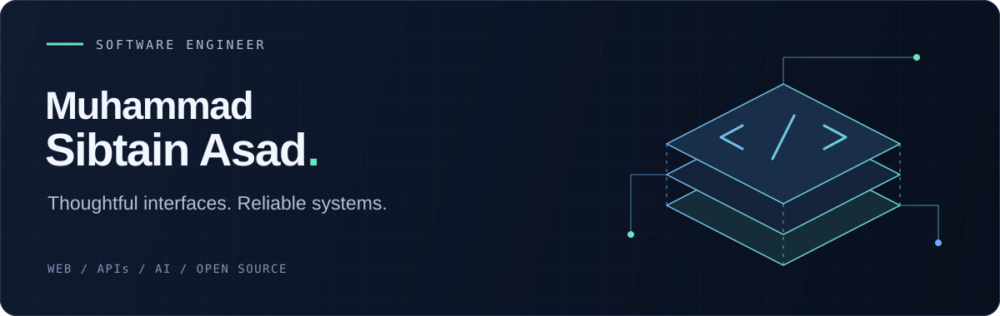

  

  <a href="https://www.sibtainasad.com/"><strong>Portfolio</strong></a>
  &nbsp; / &nbsp;
  <a href="https://www.linkedin.com/in/sibtain-asad/"><strong>LinkedIn</strong></a>
  &nbsp; / &nbsp;
  <a href="https://github.com/SIBTAIN-ASAD?tab=repositories"><strong>Repositories</strong></a>

## A little about me

I'm **Muhammad Sibtain Asad**, a software engineer based in **Lahore, Pakistan**. I build web applications and APIs with **TypeScript, React, Python, and Django**, and explore AI and cloud infrastructure.

I enjoy working across the stack: shaping an interface, designing the API behind it, and tracking down the edge cases that make software more dependable. My open-source work includes fixes, typing improvements, and tests in projects I care about.

## Selected work

### [Spotter · Route & fuel planning](https://github.com/SIBTAIN-ASAD/Spotter)
A Django REST API and interactive map for planning US driving routes and recommending fuel stops from a local price dataset. Includes a fuel optimization algorithm, injectable service clients, automated tests, and Docker setup.

`Python` · `Django REST Framework` · `GeoJSON` · `Docker` · `pytest`

### [SAM · Personal portfolio](https://github.com/SIBTAIN-ASAD/SAM-portfolio)
My portfolio brings together projects and experience through an interactive React interface, 3D visuals, and motion.

`TypeScript` · `React` · `Three.js` · `Tailwind CSS` · `Framer Motion`

**[Explore the portfolio ↗](https://www.sibtainasad.com/)**

## Open-source contributions

A few merged contributions:

- **[Apache Airflow](https://github.com/apache/airflow/pull/72659)** — Fixed DAG parsing failures caused by templated targets in `DateTimeSensorAsync`.
- **[django-stubs](https://github.com/typeddjango/django-stubs/pull/3642)** — Added a mutable `HttpRequest` typing helper for tests and request factories.
- **[AMD Gaia](https://github.com/amd/gaia/pull/3263)** — Added explicit feedback for unsupported Telegram media and a regression test.

[More contributions ↗](https://github.com/search?q=is%3Apr+is%3Amerged+author%3ASIBTAIN-ASAD+-user%3ASIBTAIN-ASAD&type=pullrequests)

## Tools I work with

**Languages** &nbsp; TypeScript · JavaScript · Python · C++

**Web & APIs** &nbsp; React · Next.js · Django · Django REST Framework · FastAPI · Tailwind CSS

**Data & infrastructure** &nbsp; PostgreSQL · Redis · Docker · GitHub Actions · AWS · Azure · Google Cloud

**AI & experimentation** &nbsp; PyTorch · TensorFlow · Reinforcement learning

---

Have an interesting engineering problem or an open-source idea? **[Let's connect on LinkedIn.](https://www.linkedin.com/in/sibtain-asad/)**
