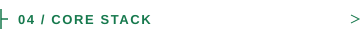
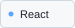
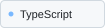
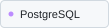

<picture>
  <source media="(prefers-color-scheme: dark) and (prefers-reduced-motion: reduce)" srcset="./assets/masthead-dark.png" />
  <source media="(prefers-reduced-motion: reduce)" srcset="./assets/masthead-light.png" />
  <source media="(prefers-color-scheme: dark)" srcset="./assets/masthead-dark.gif" />
  
</picture>

**Software engineer · Lahore, Pakistan** 
Backend systems, full-stack applications, data pipelines, and AI-agent evaluation.

<a href="https://www.sibtainasad.com/"><picture><source media="(prefers-color-scheme: dark)" srcset="./assets/link-portfolio-dark.svg" /></picture></a>
<a href="https://www.linkedin.com/in/sibtain-asad/"><picture><source media="(prefers-color-scheme: dark)" srcset="./assets/link-linkedin-dark.svg" /></picture></a>
<a href="https://github.com/SIBTAIN-ASAD?tab=repositories"><picture><source media="(prefers-color-scheme: dark)" srcset="./assets/link-repos-dark.svg" /></picture></a>

<picture><source media="(prefers-color-scheme: dark)" srcset="./assets/section-oss-dark.svg" /></picture>

Three selected contributions, accepted and merged upstream.

| Project | What I contributed | Status |
| :--- | :--- | :---: |
| **Apache Airflow** | [Fixed async datetime sensor parsing](https://github.com/apache/airflow/pull/72659) Preserved Jinja rendering during DAG construction. |  |
| **django-stubs** | [Added mutable request typing](https://github.com/typeddjango/django-stubs/pull/3642) Preserved inference for custom request subclasses. |  |
| **AMD Gaia** | [Improved Telegram media feedback](https://github.com/amd/gaia/pull/3263) Replaced silent failures; added regression coverage. |  |

<a href="https://github.com/search?q=is%3Apr+is%3Amerged+author%3ASIBTAIN-ASAD+-user%3ASIBTAIN-ASAD&amp;type=pullrequests"><picture><source media="(prefers-color-scheme: dark)" srcset="./assets/link-prs-dark.svg" /></picture></a>

<picture><source media="(prefers-color-scheme: dark)" srcset="./assets/section-build-dark.svg" /></picture>

**[Spotter](https://github.com/SIBTAIN-ASAD/Spotter)** · Route planning & fuel optimization 
Django REST API and map for US routes and fuel stops. Separate routing services, injectable clients, and automated tests. 
Python · Django REST · GeoJSON · Docker · pytest

**[SAM Portfolio](https://www.sibtainasad.com/)** · Interactive personal portfolio 
My experience and projects in a React interface with 3D visuals and motion. [Source ↗](https://github.com/SIBTAIN-ASAD/SAM-portfolio) 
TypeScript · React · Three.js · Framer Motion

<picture><source media="(prefers-color-scheme: dark)" srcset="./assets/section-career-dark.svg" /></picture>

| Team | Role & focus |
| :--- | :--- |
| **NavForward** Jun 2025–Present | **Senior Software Engineer** · Backend architecture and distributed scraping pipelines. |
| **Turing** Jun–Dec 2025 | **Software Engineer** · AI-agent training, evaluation datasets, and scoring. |
| **Devsinc** Nov 2023–Jun 2025 | **Software Engineer** · Healthcare workflows and React/TypeScript frontend architecture. |
| **i2c** Sep–Nov 2023 | **Associate Software Engineer** · Production operations, releases, and monitoring. |

<a href="./docs/BACKGROUND.md"><picture><source media="(prefers-color-scheme: dark)" srcset="./assets/link-background-dark.svg" /></picture></a>

<picture><source media="(prefers-color-scheme: dark)" srcset="./assets/section-stack-dark.svg" /></picture>

<picture><source media="(prefers-color-scheme: dark)" srcset="./assets/stack-python-dark.svg" /></picture> <picture><source media="(prefers-color-scheme: dark)" srcset="./assets/stack-django-dark.svg" /></picture> <picture><source media="(prefers-color-scheme: dark)" srcset="./assets/stack-fastapi-dark.svg" /></picture> <picture><source media="(prefers-color-scheme: dark)" srcset="./assets/stack-react-dark.svg" /></picture> <picture><source media="(prefers-color-scheme: dark)" srcset="./assets/stack-typescript-dark.svg" /></picture> <picture><source media="(prefers-color-scheme: dark)" srcset="./assets/stack-postgres-dark.svg" /></picture> <picture><source media="(prefers-color-scheme: dark)" srcset="./assets/stack-docker-dark.svg" /></picture> 

[More projects & engineering notes](./docs/BACKGROUND.md#other-public-repositories) · [Portfolio](https://www.sibtainasad.com/) · [LinkedIn](https://www.linkedin.com/in/sibtain-asad/)
