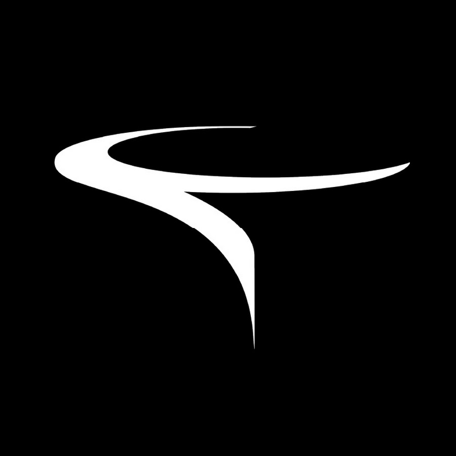
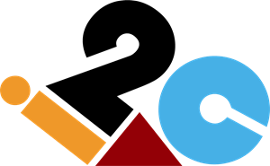

<picture>
  <source media="(prefers-color-scheme: dark) and (prefers-reduced-motion: reduce)" srcset="./assets/masthead-dark.png" />
  <source media="(prefers-reduced-motion: reduce)" srcset="./assets/masthead-light.png" />
  <source media="(prefers-color-scheme: dark)" srcset="./assets/masthead-dark.gif" />
  
</picture>

**Software engineer · Lahore, Pakistan** 
Backend systems, full-stack applications, data pipelines, and AI-agent evaluation.

<a href="https://www.sibtainasad.com/"><picture><source media="(prefers-color-scheme: dark)" srcset="./assets/link-portfolio-dark.svg" /></picture></a>
<a href="https://www.linkedin.com/in/sibtain-asad/"><picture><source media="(prefers-color-scheme: dark)" srcset="./assets/link-linkedin-dark.svg" /></picture></a>
<a href="https://github.com/SIBTAIN-ASAD?tab=repositories"><picture><source media="(prefers-color-scheme: dark)" srcset="./assets/link-repos-dark.svg" /></picture></a>

<picture>
<source media="(max-width: 600px) and (prefers-color-scheme: dark)" srcset="./assets/editorial-oss-mobile-dark.svg" />
<source media="(max-width: 600px)" srcset="./assets/editorial-oss-mobile-light.svg" />
<source media="(prefers-color-scheme: dark)" srcset="./assets/editorial-oss-dark.svg" />

</picture>

Three selected contributions, accepted and merged upstream.

<table>
<tr><td width="48" align="center"></td><td><strong>Apache Airflow</strong> &nbsp;  <a href="https://github.com/apache/airflow/pull/72659"><strong>Async datetime sensor fix</strong></a> Preserved Jinja rendering during DAG construction.</td></tr>
<tr><td width="48" align="center"></td><td><strong>django-stubs</strong> &nbsp;  <a href="https://github.com/typeddjango/django-stubs/pull/3642"><strong>Mutable request typing</strong></a> Preserved inference for custom request subclasses.</td></tr>
<tr><td width="48" align="center"></td><td><strong>AMD Gaia</strong> &nbsp;  <a href="https://github.com/amd/gaia/pull/3263"><strong>Telegram media feedback</strong></a> Replaced silent failures and added regression coverage.</td></tr>
</table>

<a href="https://github.com/search?q=is%3Apr+is%3Amerged+author%3ASIBTAIN-ASAD+-user%3ASIBTAIN-ASAD&amp;type=pullrequests"><picture><source media="(prefers-color-scheme: dark)" srcset="./assets/link-prs-dark.svg" /></picture></a>

<picture>
<source media="(max-width: 600px) and (prefers-color-scheme: dark)" srcset="./assets/editorial-build-mobile-dark.svg" />
<source media="(max-width: 600px)" srcset="./assets/editorial-build-mobile-light.svg" />
<source media="(prefers-color-scheme: dark)" srcset="./assets/editorial-build-dark.svg" />

</picture>

**[Spotter](https://github.com/SIBTAIN-ASAD/Spotter)** · Route planning & fuel optimization 
Django REST API and map for US routes and fuel stops. Separate routing services, injectable clients, and automated tests. 
Python · Django REST · GeoJSON · Docker · pytest

**[SAM Portfolio](https://www.sibtainasad.com/)** · Interactive personal portfolio 
My experience and projects in a React interface with 3D visuals and motion. [Source ↗](https://github.com/SIBTAIN-ASAD/SAM-portfolio) 
TypeScript · React · Three.js · Framer Motion

<picture>
<source media="(max-width: 600px) and (prefers-color-scheme: dark)" srcset="./assets/editorial-career-mobile-dark.svg" />
<source media="(max-width: 600px)" srcset="./assets/editorial-career-mobile-light.svg" />
<source media="(prefers-color-scheme: dark)" srcset="./assets/editorial-career-dark.svg" />

</picture>

<table>
<tr>
<td width="64" align="center" valign="middle"></td>
<td><strong>NavForward</strong> &nbsp;  Jun 2025–Present <strong>Senior Software Engineer</strong> Backend architecture · distributed scraping pipelines</td>
</tr>
<tr>
<td width="64" align="center" valign="middle"></td>
<td><strong>Turing</strong> Jun–Dec 2025 <strong>Software Engineer</strong> AI-agent training · evaluation datasets · scoring</td>
</tr>
<tr>
<td width="64" align="center" valign="middle"></td>
<td><strong>Devsinc</strong> Nov 2023–Jun 2025 <strong>Software Engineer</strong> Healthcare workflows · React/TypeScript architecture</td>
</tr>
<tr>
<td width="64" align="center" valign="middle"></td>
<td><strong>i2c</strong> Sep–Nov 2023 <strong>Associate Software Engineer</strong> Production operations · releases · monitoring</td>
</tr>
</table>

<a href="./docs/BACKGROUND.md"><picture><source media="(prefers-color-scheme: dark)" srcset="./assets/link-background-dark.svg" /></picture></a>

<picture>
<source media="(max-width: 600px) and (prefers-color-scheme: dark)" srcset="./assets/editorial-activity-mobile-dark.svg" />
<source media="(max-width: 600px)" srcset="./assets/editorial-activity-mobile-light.svg" />
<source media="(prefers-color-scheme: dark)" srcset="./assets/editorial-activity-dark.svg" />

</picture>

<picture>
<source media="(max-width: 600px) and (prefers-color-scheme: dark)" srcset="./assets/activity-mobile-dark.svg" />
<source media="(max-width: 600px)" srcset="./assets/activity-mobile-light.svg" />
<source media="(prefers-color-scheme: dark)" srcset="./assets/activity-dark.svg" />

</picture>

Daily refresh · streaks use Pakistan calendar days (PKT) · [View contribution history](https://github.com/SIBTAIN-ASAD?tab=overview)

<picture>
<source media="(max-width: 600px) and (prefers-color-scheme: dark)" srcset="./assets/editorial-tools-mobile-dark.svg" />
<source media="(max-width: 600px)" srcset="./assets/editorial-tools-mobile-light.svg" />
<source media="(prefers-color-scheme: dark)" srcset="./assets/editorial-tools-dark.svg" />

</picture>

<picture>
<source media="(max-width: 600px) and (prefers-color-scheme: dark)" srcset="./assets/toolkit-matrix-mobile-dark.svg" />
<source media="(max-width: 600px)" srcset="./assets/toolkit-matrix-mobile-light.svg" />
<source media="(prefers-color-scheme: dark)" srcset="./assets/toolkit-matrix-dark.svg" />

</picture>

[Full technology list](./docs/BACKGROUND.md#technology-index)

[More projects & engineering notes](./docs/BACKGROUND.md#other-public-repositories) · [Portfolio](https://www.sibtainasad.com/) · [LinkedIn](https://www.linkedin.com/in/sibtain-asad/)
