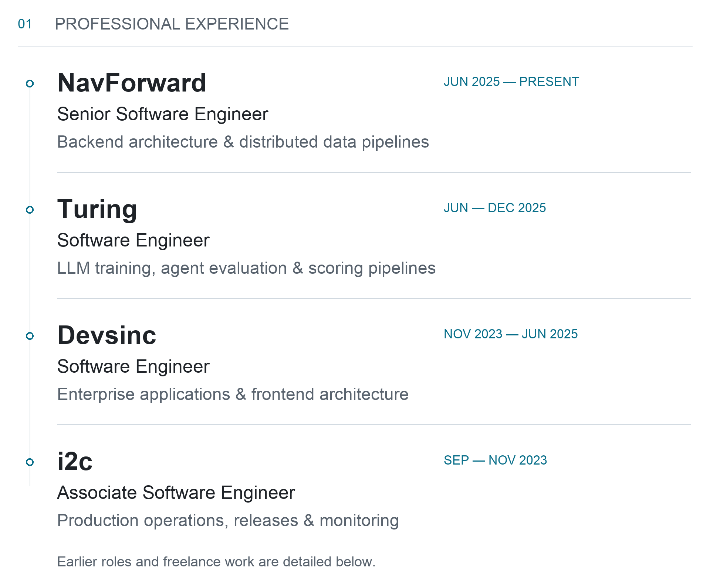
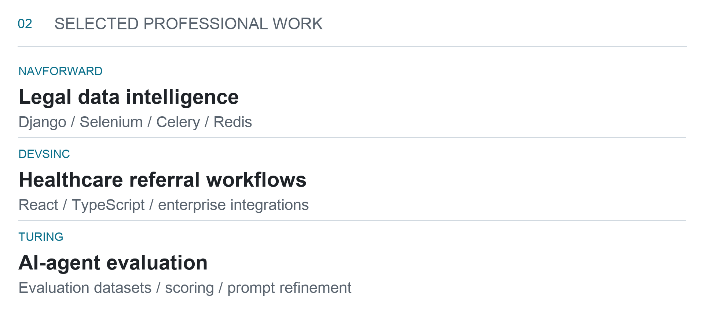
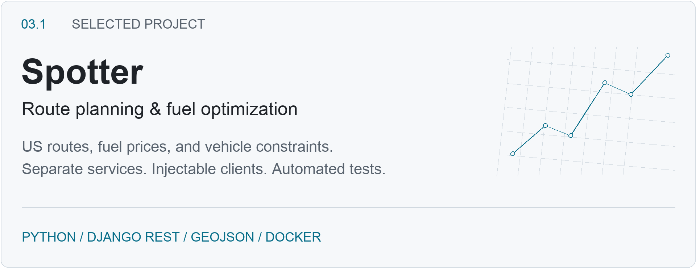
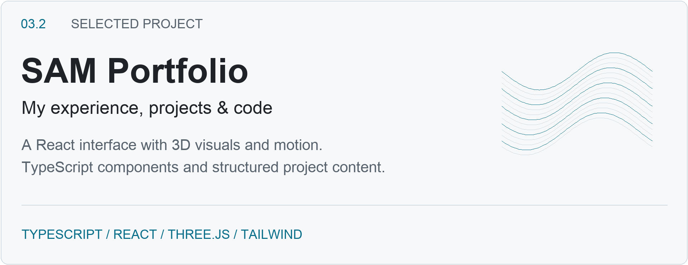
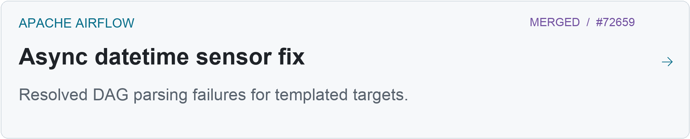
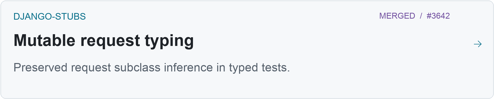
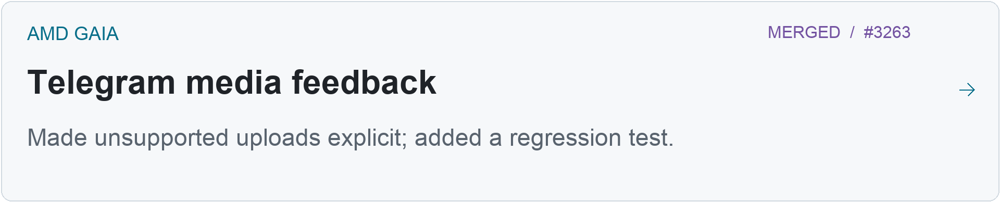
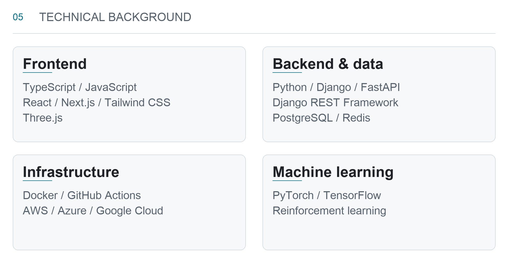

<picture>
  <source media="(prefers-color-scheme: dark) and (prefers-reduced-motion: reduce)" srcset="./assets/masthead-dark.png" />
  <source media="(prefers-reduced-motion: reduce)" srcset="./assets/masthead-light.png" />
  <source media="(prefers-color-scheme: dark)" srcset="./assets/masthead-dark.gif" />
  
</picture>

[Portfolio](https://www.sibtainasad.com/) &nbsp; / &nbsp; [LinkedIn](https://www.linkedin.com/in/sibtain-asad/) &nbsp; / &nbsp; [Repositories](https://github.com/SIBTAIN-ASAD?tab=repositories)

I’m **Muhammad Sibtain Asad**, a software engineer based in **Lahore, Pakistan**. My experience spans backend architecture, full-stack enterprise applications, data-collection pipelines, and LLM evaluation. I work primarily with **Python, Django, FastAPI, React, and TypeScript**.

At **NavForward**, my work covers backend services and distributed scraping pipelines. Previously, I worked on **AI-agent evaluation at Turing**, **healthcare and AI workflow products at Devsinc**, and **production operations at i2c**. I also contribute fixes, typing improvements, and regression tests to open source.

<picture>
  <source media="(max-width: 600px) and (prefers-color-scheme: dark)" srcset="./assets/career-mobile-dark.png" />
  <source media="(max-width: 600px)" srcset="./assets/career-mobile-light.png" />
  <source media="(prefers-color-scheme: dark)" srcset="./assets/career-dark.png" />
  
</picture>

<strong>Career history, responsibilities & earlier experience</strong>

### NavForward · Senior Software Engineer
June 2025 – Present · Remote

- Designed Django and Django REST Framework backend services and helped define microservice boundaries for US product teams.
- Built Selenium and Celery scraping pipelines with Redis-backed task processing, retries, and duplicate detection; worked with Docker, AWS, and MySQL-backed APIs.

### Turing · Software Engineer
June 2025 – December 2025 · Remote

- Worked on LLM training for AI agents and evaluation of agent task completion.
- Built evaluation pipelines covering dataset design, scoring, and prompt-refinement workflows.

### Devsinc · Software Engineer
November 2023 – June 2025 · Lahore, hybrid

- Built full-stack enterprise applications with React, Django, and FastAPI for healthcare and AI workflow products.
- Led frontend architecture with TypeScript and Material UI, including component systems and state patterns; worked on Adobe authentication, Microsoft Dynamics integrations, and patient-referral workflows.

### i2c · Associate Software Engineer
September 2023 – November 2023 · Lahore

- Supported deployments, release workflows, infrastructure monitoring, and operational runbooks.
- Worked with engineering teams to troubleshoot production issues and improve handoffs between operations and development.

Earlier experience & freelance work

**Q Information Hub · Software Engineer** · June 2021 – October 2023 
React and Django applications, REST APIs, JWT authentication, role-based access control, and PostgreSQL query optimization.

**Fiverr · Freelance Full Stack Engineer** · March 2021 – October 2023 
React and Django projects, AWS deployments, Firebase backends, and third-party integrations, from scoping through delivery.

**Upwork · Freelance Full Stack Engineer** · June 2020 – May 2023 
Web applications, dashboards, REST APIs, integrations, and ongoing maintenance for client teams.

[More about my experience →](https://www.sibtainasad.com/)

 

<picture>
  <source media="(max-width: 600px) and (prefers-color-scheme: dark)" srcset="./assets/professional-work-mobile-dark.png" />
  <source media="(max-width: 600px)" srcset="./assets/professional-work-mobile-light.png" />
  <source media="(prefers-color-scheme: dark)" srcset="./assets/professional-work-dark.png" />
  
</picture>

<strong>Read the professional project stories</strong>

**Legal data intelligence · NavForward** 
I worked on data-collection services where scraping, background jobs, and API delivery needed to work together. The implementation combined Django, Selenium, Celery, and Redis with retries and duplicate detection, deployed through Docker and AWS.

**Healthcare referral workflows · Devsinc** 
My work connected a React and TypeScript frontend to enterprise workflows, including Adobe authentication and Microsoft Dynamics. I led frontend architecture while working with the wider team on patient-referral functionality.

**AI-agent evaluation · Turing** 
I worked on assessing whether agents completed their assigned tasks, including evaluation datasets, scoring pipelines, and prompt refinement. This was evaluation and training work, alongside my application-engineering experience.

 

## Selected projects

<a href="https://github.com/SIBTAIN-ASAD/Spotter">
<picture>
  <source media="(max-width: 600px) and (prefers-color-scheme: dark)" srcset="./assets/spotter-panel-mobile-dark.png" />
  <source media="(max-width: 600px)" srcset="./assets/spotter-panel-mobile-light.png" />
  <source media="(prefers-color-scheme: dark)" srcset="./assets/spotter-panel-dark.png" />
  
</picture>
</a>

<strong>Spotter — problem, implementation & engineering detail</strong>

### [Spotter](https://github.com/SIBTAIN-ASAD/Spotter)

**Route planning & fuel optimization**

**The problem:** Plan a US driving route and recommend fuel stops using station prices and vehicle-range constraints.

**My implementation:** A Django REST API and interactive map, with separate services for routing, geocoding, station lookup, and fuel optimization. The API returns GeoJSON route geometry and fuel recommendations.

**Engineering detail:** Injectable external clients let tests exercise the planner without depending on live routing services. The project includes request IDs, health checks, throttling, and a Docker setup.

Python &nbsp; · &nbsp; Django REST Framework &nbsp; · &nbsp; GeoJSON &nbsp; · &nbsp; Docker &nbsp; · &nbsp; pytest

[Repository →](https://github.com/SIBTAIN-ASAD/Spotter) &nbsp; [Implementation notes →](https://github.com/SIBTAIN-ASAD/Spotter#readme)

 

<a href="https://www.sibtainasad.com/">
<picture>
  <source media="(max-width: 600px) and (prefers-color-scheme: dark)" srcset="./assets/portfolio-panel-mobile-dark.png" />
  <source media="(max-width: 600px)" srcset="./assets/portfolio-panel-mobile-light.png" />
  <source media="(prefers-color-scheme: dark)" srcset="./assets/portfolio-panel-dark.png" />
  
</picture>
</a>

<strong>SAM Portfolio — implementation & source</strong>

### [SAM Portfolio](https://github.com/SIBTAIN-ASAD/SAM-portfolio)

**Personal portfolio & interactive frontend**

**The purpose:** Bring my professional experience and projects together in one personal site.

**My implementation:** A React and TypeScript interface with Three.js visuals, Framer Motion transitions, and Tailwind CSS styling. The source organizes the experience, project, and technology content separately from the UI components.

TypeScript &nbsp; · &nbsp; React &nbsp; · &nbsp; Three.js &nbsp; · &nbsp; Tailwind CSS &nbsp; · &nbsp; Framer Motion

[Live portfolio →](https://www.sibtainasad.com/) &nbsp; [Source →](https://github.com/SIBTAIN-ASAD/SAM-portfolio)

 

## Open-source contributions

<a href="https://github.com/apache/airflow/pull/72659">
<picture>
  <source media="(max-width: 600px) and (prefers-color-scheme: dark)" srcset="./assets/contribution-airflow-mobile-dark.png" />
  <source media="(max-width: 600px)" srcset="./assets/contribution-airflow-mobile-light.png" />
  <source media="(prefers-color-scheme: dark)" srcset="./assets/contribution-airflow-dark.png" />
  
</picture>
</a>

<a href="https://github.com/typeddjango/django-stubs/pull/3642">
<picture>
  <source media="(max-width: 600px) and (prefers-color-scheme: dark)" srcset="./assets/contribution-django-mobile-dark.png" />
  <source media="(max-width: 600px)" srcset="./assets/contribution-django-mobile-light.png" />
  <source media="(prefers-color-scheme: dark)" srcset="./assets/contribution-django-dark.png" />
  
</picture>
</a>

<a href="https://github.com/amd/gaia/pull/3263">
<picture>
  <source media="(max-width: 600px) and (prefers-color-scheme: dark)" srcset="./assets/contribution-gaia-mobile-dark.png" />
  <source media="(max-width: 600px)" srcset="./assets/contribution-gaia-mobile-light.png" />
  <source media="(prefers-color-scheme: dark)" srcset="./assets/contribution-gaia-dark.png" />
  
</picture>
</a>

<strong>Contribution details & all merged pull requests</strong>

These changes were accepted and merged into the upstream projects. Each addresses a specific failure or developer-experience issue.

| Project | Contribution & significance |
| :--- | :--- |
| **Apache Airflow** | [Async datetime sensor fix](https://github.com/apache/airflow/pull/72659) — prevented raw Jinja targets from being parsed during DAG construction, preserving the normal rendering path. |
| **django-stubs** | [Mutable request typing](https://github.com/typeddjango/django-stubs/pull/3642) — added a helper for tests and request factories while preserving inference for custom request subclasses. |
| **AMD Gaia** | [Telegram media feedback](https://github.com/amd/gaia/pull/3263) — replaced silent handling of unsupported uploads with explicit feedback and a video-path regression test. |

[All merged contributions →](https://github.com/search?q=is%3Apr+is%3Amerged+author%3ASIBTAIN-ASAD+-user%3ASIBTAIN-ASAD&type=pullrequests)

 

<picture>
  <source media="(max-width: 600px) and (prefers-color-scheme: dark)" srcset="./assets/skills-panel-mobile-dark.png" />
  <source media="(max-width: 600px)" srcset="./assets/skills-panel-mobile-light.png" />
  <source media="(prefers-color-scheme: dark)" srcset="./assets/skills-panel-dark.png" />
  
</picture>

<strong>Full technology list</strong>

| Area | Technologies |
| :--- | :--- |
| **Frontend** | TypeScript, JavaScript, React, Next.js, Tailwind CSS, Three.js |
| **Backend & data** | Python, Django, Django REST Framework, FastAPI, PostgreSQL, Redis |
| **Infrastructure** | Docker, GitHub Actions, AWS, Azure, Google Cloud |
| **Machine learning** | PyTorch, TensorFlow, reinforcement learning |

More projects & implementation details

**Spotter deployment scope:** Public routing and geocoding services support experimentation; larger deployments would need their own service arrangements.

**Other public repositories**

- [Flight booking management system](https://github.com/SIBTAIN-ASAD/Flight-MS-Python) — a terminal-based Python application with customer memberships, services, bookings, and text-file persistence.
- [C data structures and algorithms](https://github.com/SIBTAIN-ASAD/C-ADTs-DSA) — heap and binary search tree implementations.
- [Quora-style web application](https://github.com/SIBTAIN-ASAD/quora) — questions, answers, and comments.
- [C++ Checkers](https://github.com/SIBTAIN-ASAD/Checkers-C-) — move suggestions and file-based game data.

---

[**sibtainasad.com**](https://www.sibtainasad.com/) &nbsp; · &nbsp; [**LinkedIn**](https://www.linkedin.com/in/sibtain-asad/)
