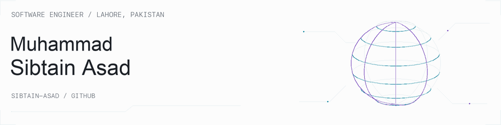
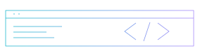

# Muhammad Sibtain Asad

**Software Engineer** · Lahore, Pakistan<br>
TypeScript · React · Python · Django

[**Portfolio ↗**](https://www.sibtainasad.com/) &nbsp; · &nbsp; [**LinkedIn ↗**](https://www.linkedin.com/in/sibtain-asad/) &nbsp; · &nbsp; [**Explore my code ↗**](https://github.com/SIBTAIN-ASAD?tab=repositories)

<picture>
  <source media="(prefers-color-scheme: dark) and (prefers-reduced-motion: reduce)" srcset="./assets/profile-neon-dark.png" />
  <source media="(prefers-reduced-motion: reduce)" srcset="./assets/profile-neon-light.png" />
  <source media="(prefers-color-scheme: dark)" srcset="./assets/profile-neon-dark.gif" />
  
</picture>

<p>
  
  
  
  
  
  
  
</p>

I'm **Muhammad Sibtain Asad**, a software engineer based in **Lahore, Pakistan**. I work with **TypeScript, React, Python, and Django** on web applications and APIs.

My public projects include **Spotter**, a route and fuel-planning API, and **SAM**, my interactive portfolio. I've also contributed merged fixes, typing improvements, and tests to **Apache Airflow**, **django-stubs**, and **AMD Gaia**.


## My projects

<table>
<tr>
<td width="50%" valign="top">

### [Spotter](https://github.com/SIBTAIN-ASAD/Spotter)


**Route & fuel planning**

My route-planning project combines a Django REST API with an interactive map to plan US driving routes and recommend fuel stops.

- GeoJSON route geometry
- Fuel-price and range-based optimization
- Injectable services and automated tests
- Docker development setup

`Python` `Django REST` `GeoJSON`

[**Explore repository →**](https://github.com/SIBTAIN-ASAD/Spotter)

</td>
<td width="50%" valign="top">

### [SAM Portfolio](https://github.com/SIBTAIN-ASAD/SAM-portfolio)


**Interfaces, 3D & motion**

My personal portfolio brings together my projects and experience using React, TypeScript, 3D visuals, and motion.

- Component-based interface
- Three.js visual elements
- Framer Motion transitions
- Tailwind CSS styling

`TypeScript` `React` `Three.js`

[**Live site →**](https://www.sibtainasad.com/) · [**Source →**](https://github.com/SIBTAIN-ASAD/SAM-portfolio)

</td>
</tr>
</table>

<details>
<summary><strong>Under the hood: Spotter's service design</strong></summary>

```text
Request → Route planner → Geocoding + routing
                       → Local fuel-station lookup
                       → Fuel optimizer → GeoJSON + recommendations
```

The planner coordinates separate clients and services, so tests can replace external dependencies. The project includes request IDs, health checks, throttling, and consistent error responses. Public routing and geocoding services support experimentation; larger deployments would need their own service arrangements.

[Read the implementation notes →](https://github.com/SIBTAIN-ASAD/Spotter#readme)

</details>


## My open-source contributions

<table>
<tr>
<td width="25%"><strong>Apache Airflow</strong><br><br></td>
<td><strong><a href="https://github.com/apache/airflow/pull/72659">Async datetime sensor fix ↗</a></strong><br><br>I fixed DAG parsing failures caused by templated targets, deferring handling until the target value is ready to resolve.</td>
</tr>
<tr>
<td><strong>django-stubs</strong><br><br></td>
<td><strong><a href="https://github.com/typeddjango/django-stubs/pull/3642">Mutable request typing ↗</a></strong><br><br>I added a mutable HttpRequest helper for tests and request factories while preserving request subclass inference.</td>
</tr>
<tr>
<td><strong>AMD Gaia</strong><br><br></td>
<td><strong><a href="https://github.com/amd/gaia/pull/3263">Telegram media feedback ↗</a></strong><br><br>I added explicit feedback for unsupported uploads and a regression test for the video path.</td>
</tr>
</table>

[**Browse more merged contributions →**](https://github.com/search?q=is%3Apr+is%3Amerged+author%3ASIBTAIN-ASAD+-user%3ASIBTAIN-ASAD&type=pullrequests)


## Technologies I use

| Frontend | Backend | Infrastructure | Machine learning |
| :--- | :--- | :--- | :--- |
| TypeScript · JavaScript | Python · Django | Docker | PyTorch |
| React · Next.js | Django REST · FastAPI | GitHub Actions | TensorFlow |
| Tailwind CSS | PostgreSQL · Redis | AWS · Azure · GCP | |
| Three.js · Framer Motion | API design & testing | Cloud infrastructure | Reinforcement learning |

<details>
<summary><strong>More from my repositories</strong></summary>

- [C data structures and algorithms](https://github.com/SIBTAIN-ASAD/C-ADTs-DSA) — heap and binary search tree implementations.
- [Quora-style web application](https://github.com/SIBTAIN-ASAD/quora) — questions, answers, and comments.
- [C++ Checkers](https://github.com/SIBTAIN-ASAD/Checkers-C-) — a checkers game with move suggestions and file-based game data.

</details>

---


### Find me online


[**Connect on LinkedIn ↗**](https://www.linkedin.com/in/sibtain-asad/) · [**Visit my portfolio ↗**](https://www.sibtainasad.com/)
