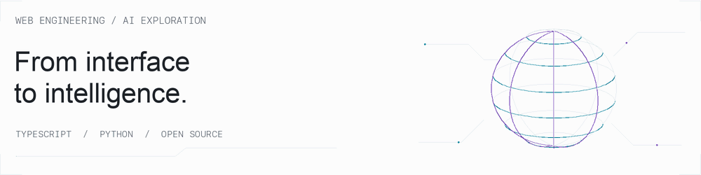

# Muhammad Sibtain Asad

**Software Engineer** · Lahore, Pakistan<br>
Building web applications and APIs. Exploring AI. Contributing to open source.

[**Portfolio ↗**](https://www.sibtainasad.com/) &nbsp; · &nbsp; [**LinkedIn ↗**](https://www.linkedin.com/in/sibtain-asad/) &nbsp; · &nbsp; [**Explore my code ↗**](https://github.com/SIBTAIN-ASAD?tab=repositories)

<picture>
  <source media="(prefers-color-scheme: dark) and (prefers-reduced-motion: reduce)" srcset="./assets/neon-core-dark.png" />
  <source media="(prefers-reduced-motion: reduce)" srcset="./assets/neon-core-light.png" />
  <source media="(prefers-color-scheme: dark)" srcset="./assets/neon-core-dark.gif" />
  
</picture>

<p>
  
  
  
  
  
  
  
</p>

I work across the stack, from **React interfaces** to **Python services**, with an interest in the details that make software dependable: clear APIs, useful types, automated tests, and well-handled edge cases.


## Featured repositories

<table>
<tr>
<td width="50%" valign="top">

### [Spotter](https://github.com/SIBTAIN-ASAD/Spotter)


**Route & fuel planning**

A Django REST API and interactive map for planning US driving routes and recommending fuel stops.

- GeoJSON route geometry
- Fuel-price and range-based optimization
- Injectable services and automated tests
- Docker development setup

`Python` `Django REST` `GeoJSON`

[**Explore repository →**](https://github.com/SIBTAIN-ASAD/Spotter)

</td>
<td width="50%" valign="top">

### [SAM Portfolio](https://github.com/SIBTAIN-ASAD/SAM-portfolio)


**Interfaces, 3D & motion**

An interactive showcase of my projects and experience, built with React and TypeScript.

- Component-based interface
- Three.js visual elements
- Framer Motion transitions
- Tailwind CSS styling

`TypeScript` `React` `Three.js`

[**Live site →**](https://www.sibtainasad.com/) · [**Source →**](https://github.com/SIBTAIN-ASAD/SAM-portfolio)

</td>
</tr>
</table>

<details>
<summary><strong>Under the hood: Spotter's service design</strong></summary>

```text
Request → Route planner → Geocoding + routing
                       → Local fuel-station lookup
                       → Fuel optimizer → GeoJSON + recommendations
```

The planner coordinates separate clients and services, so tests can replace external dependencies. The project includes request IDs, health checks, throttling, and consistent error responses. Public routing and geocoding services support experimentation; larger deployments would need their own service arrangements.

[Read the implementation notes →](https://github.com/SIBTAIN-ASAD/Spotter#readme)

</details>


## Contributions beyond my repositories

<table>
<tr>
<td width="25%"><strong>Apache Airflow</strong><br><br></td>
<td><strong><a href="https://github.com/apache/airflow/pull/72659">Async datetime sensor fix ↗</a></strong><br><br>Fixed DAG parsing failures caused by templated targets. Deferred handling until the target value is ready to resolve.</td>
</tr>
<tr>
<td><strong>django-stubs</strong><br><br></td>
<td><strong><a href="https://github.com/typeddjango/django-stubs/pull/3642">Mutable request typing ↗</a></strong><br><br>Added a mutable HttpRequest helper for tests and request factories while preserving request subclass inference.</td>
</tr>
<tr>
<td><strong>AMD Gaia</strong><br><br></td>
<td><strong><a href="https://github.com/amd/gaia/pull/3263">Telegram media feedback ↗</a></strong><br><br>Added explicit feedback for unsupported uploads and a regression test for the video path.</td>
</tr>
</table>

[**Browse more merged contributions →**](https://github.com/search?q=is%3Apr+is%3Amerged+author%3ASIBTAIN-ASAD+-user%3ASIBTAIN-ASAD&type=pullrequests)


## Engineering toolkit

| Build the interface | Design the service | Ship & operate | Explore AI |
| :--- | :--- | :--- | :--- |
| TypeScript · JavaScript | Python · Django | Docker | PyTorch |
| React · Next.js | Django REST · FastAPI | GitHub Actions | TensorFlow |
| Tailwind CSS | PostgreSQL · Redis | AWS · Azure · GCP | Reinforcement learning |
| Three.js · Framer Motion | API design & testing | Cloud infrastructure | Experimentation |

<details>
<summary><strong>A little more about how I work</strong></summary>

- I enjoy connecting an interface to the services behind it.
- I like investigating the failure cases behind apparently simple features.
- My open-source contributions include bug fixes, stronger types, and regression tests.
- Alongside web development, I explore reinforcement learning and practical AI applications.
- I also work with C++ and keep data structures and algorithms projects in my repositories.

</details>

---


### Let's build something useful.

Have an engineering problem, a project, or an open-source idea to discuss?<br>
[**Connect on LinkedIn ↗**](https://www.linkedin.com/in/sibtain-asad/) · [**Visit my portfolio ↗**](https://www.sibtainasad.com/)
