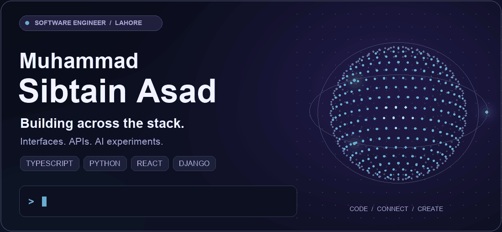
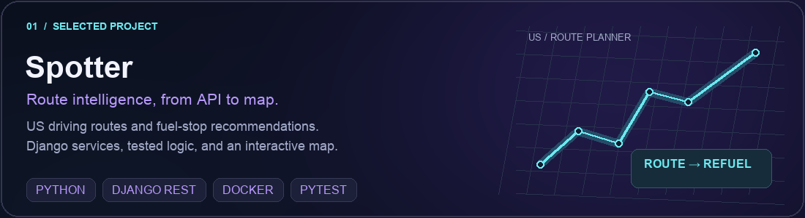
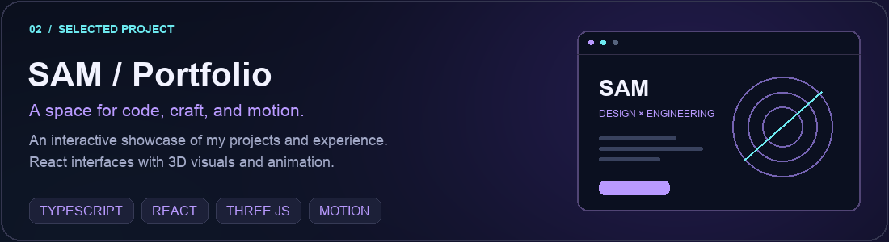
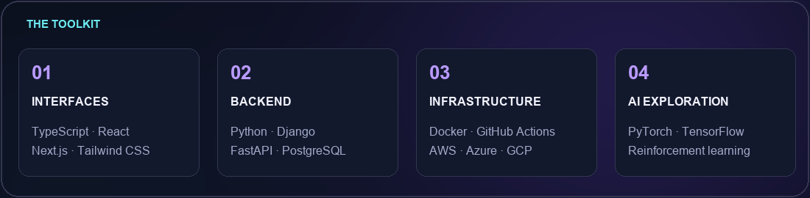
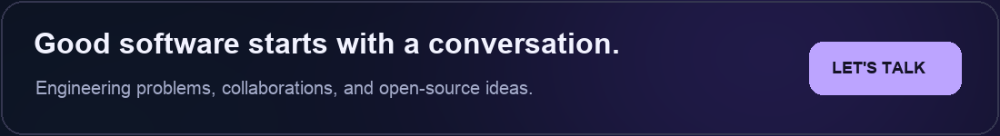

  <picture>
    <source media="(prefers-reduced-motion: reduce)" srcset="./assets/profile-hero-static.png" />
    
  </picture>

  <a href="https://www.sibtainasad.com/"><strong>EXPLORE PORTFOLIO ↗</strong></a>
  &nbsp; &nbsp; / &nbsp; &nbsp;
  <a href="https://www.linkedin.com/in/sibtain-asad/"><strong>CONNECT ON LINKEDIN ↗</strong></a>
  &nbsp; &nbsp; / &nbsp; &nbsp;
  <a href="https://github.com/SIBTAIN-ASAD?tab=repositories"><strong>VIEW CODE ↗</strong></a>

 

### Building across the stack. Exploring what comes next.

I'm **Muhammad Sibtain Asad**, a software engineer based in **Lahore, Pakistan**. I build web applications and APIs with **TypeScript, React, Python, and Django**, and explore AI and cloud infrastructure.

From the interface to the service behind it, I care about the details that make software useful and dependable. Here you'll find personal projects, experiments, and contributions to open source.

 

## Selected builds

**[Explore Spotter ↗](https://github.com/SIBTAIN-ASAD/Spotter)** · Route planning, fuel optimization, and an interactive map.

 

**[View the live portfolio ↗](https://www.sibtainasad.com/)** · **[Browse the source ↗](https://github.com/SIBTAIN-ASAD/SAM-portfolio)**

 

## Beyond my own code

Real fixes. Merged contributions.

| Project | Contribution | Status |
| :--- | :--- | :--- |
| **Apache Airflow** | [Fixed DAG parsing failures for templated async datetime sensors ↗](https://github.com/apache/airflow/pull/72659) | Merged |
| **django-stubs** | [Added a mutable HttpRequest typing helper for tests and request factories ↗](https://github.com/typeddjango/django-stubs/pull/3642) | Merged |
| **AMD Gaia** | [Added feedback for unsupported Telegram media and a regression test ↗](https://github.com/amd/gaia/pull/3263) | Merged |

**[Explore more contributions ↗](https://github.com/search?q=is%3Apr+is%3Amerged+author%3ASIBTAIN-ASAD+-user%3ASIBTAIN-ASAD&type=pullrequests)**

 

## Tools behind the work

<strong>Explore the full toolkit</strong>

- **Languages:** TypeScript, JavaScript, Python, C++
- **Interfaces:** React, Next.js, Tailwind CSS, Three.js, Framer Motion
- **APIs & data:** Django, Django REST Framework, FastAPI, PostgreSQL, Redis
- **Infrastructure:** Docker, GitHub Actions, AWS, Azure, Google Cloud
- **AI & experimentation:** PyTorch, TensorFlow, reinforcement learning

 

Thoughtful interfaces. Dependable systems. Always exploring.

