<picture>
  <source media="(prefers-color-scheme: dark) and (prefers-reduced-motion: reduce)" srcset="./assets/masthead-dark.png" />
  <source media="(prefers-reduced-motion: reduce)" srcset="./assets/masthead-light.png" />
  <source media="(prefers-color-scheme: dark)" srcset="./assets/masthead-dark.gif" />
  
</picture>

**Software engineer · Lahore, Pakistan** 
Backend systems, full-stack applications, data pipelines, and AI-agent evaluation.

<a href="https://www.sibtainasad.com/"><picture><source media="(prefers-color-scheme: dark)" srcset="./assets/link-portfolio-dark.svg" /></picture></a>
<a href="https://www.linkedin.com/in/sibtain-asad/"><picture><source media="(prefers-color-scheme: dark)" srcset="./assets/link-linkedin-dark.svg" /></picture></a>
<a href="https://github.com/SIBTAIN-ASAD?tab=repositories"><picture><source media="(prefers-color-scheme: dark)" srcset="./assets/link-repos-dark.svg" /></picture></a>

<picture><source media="(prefers-color-scheme: dark)" srcset="./assets/section-oss-dark.svg" /></picture>

Three selected contributions, accepted and merged upstream.

| Project | What I contributed | Status |
| :--- | :--- | :---: |
|  **Apache Airflow** | [Fixed async datetime sensor parsing](https://github.com/apache/airflow/pull/72659) Preserved Jinja rendering during DAG construction. |  |
|  **django-stubs** | [Added mutable request typing](https://github.com/typeddjango/django-stubs/pull/3642) Preserved inference for custom request subclasses. |  |
|  **AMD Gaia** | [Improved Telegram media feedback](https://github.com/amd/gaia/pull/3263) Replaced silent failures; added regression coverage. |  |

<a href="https://github.com/search?q=is%3Apr+is%3Amerged+author%3ASIBTAIN-ASAD+-user%3ASIBTAIN-ASAD&amp;type=pullrequests"><picture><source media="(prefers-color-scheme: dark)" srcset="./assets/link-prs-dark.svg" /></picture></a>

<picture><source media="(prefers-color-scheme: dark)" srcset="./assets/section-build-dark.svg" /></picture>

**[Spotter](https://github.com/SIBTAIN-ASAD/Spotter)** · Route planning & fuel optimization 
Django REST API and map for US routes and fuel stops. Separate routing services, injectable clients, and automated tests. 
Python · Django REST · GeoJSON · Docker · pytest

**[SAM Portfolio](https://www.sibtainasad.com/)** · Interactive personal portfolio 
My experience and projects in a React interface with 3D visuals and motion. [Source ↗](https://github.com/SIBTAIN-ASAD/SAM-portfolio) 
TypeScript · React · Three.js · Framer Motion

<picture><source media="(prefers-color-scheme: dark)" srcset="./assets/section-career-dark.svg" /></picture>

| Team | Role & focus |
| :--- | :--- |
| **NavForward** Jun 2025–Present | **Senior Software Engineer** · Backend architecture and distributed scraping pipelines. |
| **Turing** Jun–Dec 2025 | **Software Engineer** · AI-agent training, evaluation datasets, and scoring. |
| **Devsinc** Nov 2023–Jun 2025 | **Software Engineer** · Healthcare workflows and React/TypeScript frontend architecture. |
| **i2c** Sep–Nov 2023 | **Associate Software Engineer** · Production operations, releases, and monitoring. |

<a href="./docs/BACKGROUND.md"><picture><source media="(prefers-color-scheme: dark)" srcset="./assets/link-background-dark.svg" /></picture></a>

## GitHub activity

<picture>
<source media="(max-width: 600px) and (prefers-color-scheme: dark)" srcset="./assets/activity-mobile-dark.svg" />
<source media="(max-width: 600px)" srcset="./assets/activity-mobile-light.svg" />
<source media="(prefers-color-scheme: dark)" srcset="./assets/activity-dark.svg" />

</picture>

Daily refresh · streaks use Pakistan calendar days (PKT) · [View contribution history](https://github.com/SIBTAIN-ASAD?tab=overview)

## Technologies & tools

Tools from my professional experience and public projects, grouped by purpose.

### Languages

<picture><source media="(prefers-color-scheme: dark)" srcset="./assets/tool-logo-python-dark.svg" /></picture>
<picture><source media="(prefers-color-scheme: dark)" srcset="./assets/tool-logo-javascript-dark.svg" />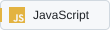</picture>
<picture><source media="(prefers-color-scheme: dark)" srcset="./assets/tool-logo-typescript-dark.svg" />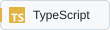</picture>
<picture><source media="(prefers-color-scheme: dark)" srcset="./assets/tool-logo-c-dark.svg" /></picture>
<picture><source media="(prefers-color-scheme: dark)" srcset="./assets/tool-logo-cpp-dark.svg" />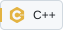</picture>
<picture><source media="(prefers-color-scheme: dark)" srcset="./assets/tool-logo-php-dark.svg" /></picture>
<picture><source media="(prefers-color-scheme: dark)" srcset="./assets/tool-logo-8086-assembly-dark.svg" /></picture>

### Frontend & motion

<picture><source media="(prefers-color-scheme: dark)" srcset="./assets/tool-logo-html-dark.svg" />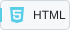</picture>
<picture><source media="(prefers-color-scheme: dark)" srcset="./assets/tool-logo-css-dark.svg" />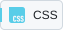</picture>
<picture><source media="(prefers-color-scheme: dark)" srcset="./assets/tool-logo-react-dark.svg" />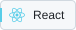</picture>
<picture><source media="(prefers-color-scheme: dark)" srcset="./assets/tool-logo-next.js-dark.svg" />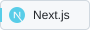</picture>
<picture><source media="(prefers-color-scheme: dark)" srcset="./assets/tool-logo-redux-toolkit-dark.svg" /></picture>
<picture><source media="(prefers-color-scheme: dark)" srcset="./assets/tool-logo-tailwind-css-dark.svg" /></picture>
<picture><source media="(prefers-color-scheme: dark)" srcset="./assets/tool-logo-material-ui-dark.svg" /></picture>
<picture><source media="(prefers-color-scheme: dark)" srcset="./assets/tool-logo-three.js-dark.svg" />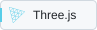</picture>
<picture><source media="(prefers-color-scheme: dark)" srcset="./assets/tool-logo-framer-motion-dark.svg" /></picture>
<picture><source media="(prefers-color-scheme: dark)" srcset="./assets/tool-logo-gsap-dark.svg" /></picture>
<picture><source media="(prefers-color-scheme: dark)" srcset="./assets/tool-logo-react-router-dark.svg" /></picture>

### Backend & automation

<picture><source media="(prefers-color-scheme: dark)" srcset="./assets/tool-logo-django-dark.svg" /></picture>
<picture><source media="(prefers-color-scheme: dark)" srcset="./assets/tool-logo-django-rest-dark.svg" />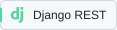</picture>
<picture><source media="(prefers-color-scheme: dark)" srcset="./assets/tool-logo-fastapi-dark.svg" />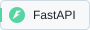</picture>
<picture><source media="(prefers-color-scheme: dark)" srcset="./assets/tool-logo-express-dark.svg" /></picture>
<picture><source media="(prefers-color-scheme: dark)" srcset="./assets/tool-logo-celery-dark.svg" />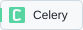</picture>
<picture><source media="(prefers-color-scheme: dark)" srcset="./assets/tool-logo-selenium-dark.svg" />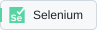</picture>
<picture><source media="(prefers-color-scheme: dark)" srcset="./assets/tool-logo-rest-apis-dark.svg" />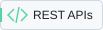</picture>

### Databases & services

<picture><source media="(prefers-color-scheme: dark)" srcset="./assets/tool-logo-postgresql-dark.svg" /></picture>
<picture><source media="(prefers-color-scheme: dark)" srcset="./assets/tool-logo-mysql-dark.svg" />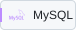</picture>
<picture><source media="(prefers-color-scheme: dark)" srcset="./assets/tool-logo-mongodb-dark.svg" />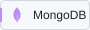</picture>
<picture><source media="(prefers-color-scheme: dark)" srcset="./assets/tool-logo-redis-dark.svg" /></picture>
<picture><source media="(prefers-color-scheme: dark)" srcset="./assets/tool-logo-firebase-dark.svg" />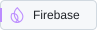</picture>

### Cloud & delivery

<picture><source media="(prefers-color-scheme: dark)" srcset="./assets/tool-logo-aws-dark.svg" />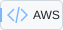</picture>
<picture><source media="(prefers-color-scheme: dark)" srcset="./assets/tool-logo-azure-dark.svg" />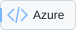</picture>
<picture><source media="(prefers-color-scheme: dark)" srcset="./assets/tool-logo-google-cloud-dark.svg" />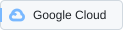</picture>
<picture><source media="(prefers-color-scheme: dark)" srcset="./assets/tool-logo-docker-dark.svg" /></picture>
<picture><source media="(prefers-color-scheme: dark)" srcset="./assets/tool-logo-github-actions-dark.svg" />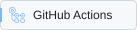</picture>
<picture><source media="(prefers-color-scheme: dark)" srcset="./assets/tool-logo-git-dark.svg" />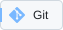</picture>

### AI & machine learning

<picture><source media="(prefers-color-scheme: dark)" srcset="./assets/tool-logo-pytorch-dark.svg" /></picture>
<picture><source media="(prefers-color-scheme: dark)" srcset="./assets/tool-logo-tensorflow-dark.svg" /></picture>
<picture><source media="(prefers-color-scheme: dark)" srcset="./assets/tool-logo-reinforcement-learning-dark.svg" />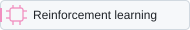</picture>
<picture><source media="(prefers-color-scheme: dark)" srcset="./assets/tool-logo-llm-evaluation-dark.svg" /></picture>

### Product integrations

<picture><source media="(prefers-color-scheme: dark)" srcset="./assets/tool-logo-microsoft-dynamics-dark.svg" />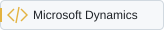</picture>
<picture><source media="(prefers-color-scheme: dark)" srcset="./assets/tool-logo-adobe-authentication-dark.svg" />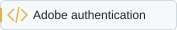</picture>
<picture><source media="(prefers-color-scheme: dark)" srcset="./assets/tool-logo-emailjs-dark.svg" />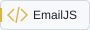</picture>
<picture><source media="(prefers-color-scheme: dark)" srcset="./assets/tool-logo-sendgrid-dark.svg" />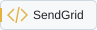</picture>

### Testing & development

<picture><source media="(prefers-color-scheme: dark)" srcset="./assets/tool-logo-pytest-dark.svg" /></picture>
<picture><source media="(prefers-color-scheme: dark)" srcset="./assets/tool-logo-vite-dark.svg" /></picture>
<picture><source media="(prefers-color-scheme: dark)" srcset="./assets/tool-logo-eslint-dark.svg" />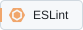</picture>
<picture><source media="(prefers-color-scheme: dark)" srcset="./assets/tool-logo-prettier-dark.svg" /></picture>
<picture><source media="(prefers-color-scheme: dark)" srcset="./assets/tool-logo-npm-dark.svg" />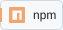</picture>
<picture><source media="(prefers-color-scheme: dark)" srcset="./assets/tool-logo-yarn-dark.svg" />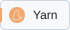</picture>
<picture><source media="(prefers-color-scheme: dark)" srcset="./assets/tool-logo-github-dark.svg" /></picture>
<picture><source media="(prefers-color-scheme: dark)" srcset="./assets/tool-logo-geojson-dark.svg" />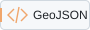</picture>

[More projects & engineering notes](./docs/BACKGROUND.md#other-public-repositories) · [Portfolio](https://www.sibtainasad.com/) · [LinkedIn](https://www.linkedin.com/in/sibtain-asad/)
